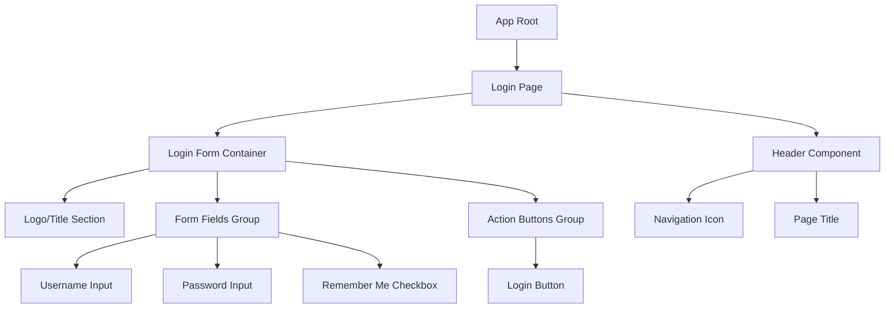
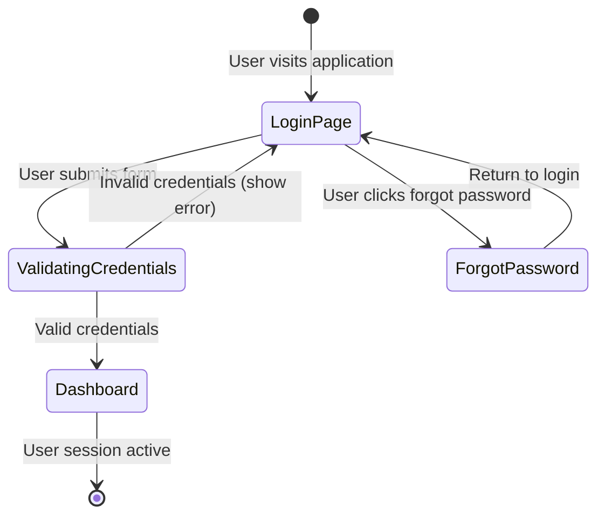
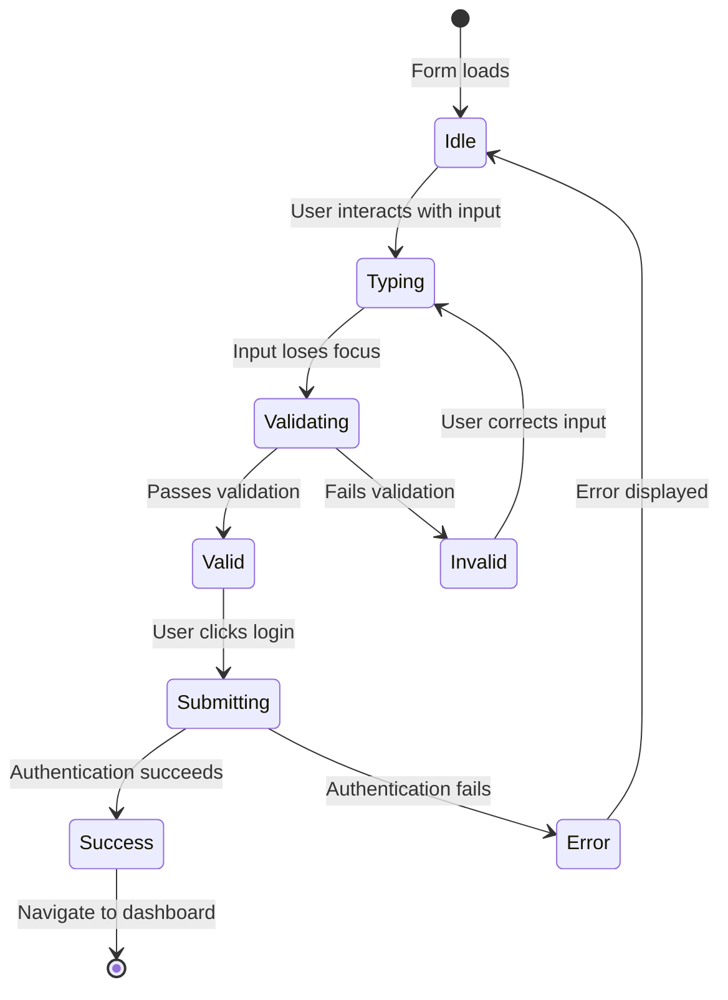
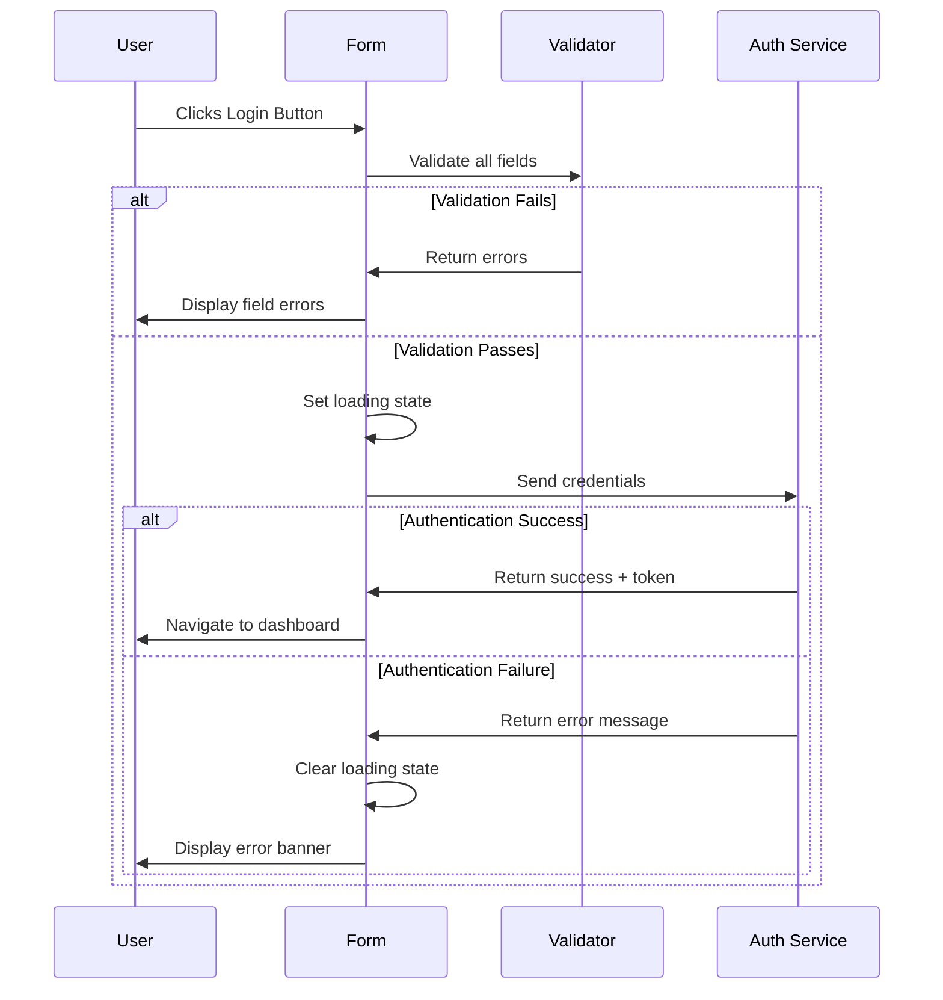

# UI-Only Design Document

## Overview

This document defines the user interface design for a School Financial Management System login page. The interface is Arabic-first with RTL support, emphasizing simplicity, accessibility, and professional design.

### Design Goals
- Clean, professional authentication interface
- Right-to-left (RTL) text direction for Arabic content
- Responsive design across all device sizes
- WCAG AA accessibility compliance
- Trustworthy visual identity for financial operations

## Technology Stack

### Required Dependencies
- Component-based framework (React, Vue, or Angular)
- RTL layout support
- Form validation library
- i18n library for bilingual support
- CSS framework (Tailwind CSS recommended)
- Icon library

### Design System Requirements
- Custom color palette for trust and professionalism
- Arabic and English typography support
- 4px-based spacing system
- Consistent component styling

## Component Architecture

### Component Hierarchy



### Component Definitions

#### 1. Login Page Component
**Purpose:** Main container for the authentication interface

**Visual Structure:**
- Full viewport height layout
- Centered card-based design
- Light background with subtle patterns or gradients
- Logo/branding positioned in top-right corner

**Responsive Behavior:**
- Desktop: Centered card with fixed max-width (400-500px)
- Tablet: Card maintains centering with responsive padding
- Mobile: Full-width card with minimal margins

#### 2. Header Component
**Purpose:** Application branding and navigation

**Elements:**
- Navigation/menu icon (24-32px, #1F2937)
- Primary text: "النظام المالي المدرسي" (School Financial System) - bold
- Secondary text: "سجل الدخول للمتابعة إلى لوحة التحكم المالية" - muted color
- Right-aligned for RTL layout

#### 3. Login Form Container
**Purpose:** Houses all form elements

**Specifications:**
- Background: #FFFFFF
- Border radius: 12px
- Shadow: 0 4px 6px rgba(0, 0, 0, 0.1)
- Padding: 48px (desktop), 24px (mobile)
- Max-width: 560px
- Title: "تسجيل الدخول" with arrow icon
- Subtitle: "أدخل بيانات اعتمادات للوصول إلى حسابك"
- Right-aligned text

#### 4. Username Input Field

| Property | Value |
|----------|-------|
| Label | اسم المستخدم (Username) |
| Placeholder | example.admin |
| Input Type | text |
| Direction | LTR |
| Validation | Required, min 3 characters |
| Error Messages | "اسم المستخدم مطلوب" / "تنسيق اسم المستخدم غير صحيح" |

**Behavior:** Validates on blur, displays errors below field

#### 5. Password Input Field

| Property | Value |
|----------|-------|
| Label | كلمة المرور (Password) |
| Placeholder | ••••••••• |
| Input Type | password |
| Direction | LTR |
| Validation | Required, min 6 characters |
| Toggle Visibility | Optional eye icon |
| Error Messages | "كلمة المرور مطلوبة" / "كلمة المرور قصيرة جدًا" |

**Behavior:** Masks characters, validates on blur, optional reveal toggle

#### 6. Remember Me Checkbox

| Property | Value |
|----------|-------|
| Label | تذكرني (Remember Me) |
| Default State | Unchecked |
| Position | Below password, right-aligned |
| Style | Custom styled with brand colors |

**Behavior:** Toggles session persistence preference

#### 7. Login Button

| Property | Value |
|----------|-------|
| Label | دخول (Login) with arrow icon |
| Width | Full-width |
| Height | 52px |
| Background | #14B8A6

## Styling Strategy

### Color Palette

| Color Name | Hex Code | Usage |
|-----------|----------|-------|
| Primary Teal | #14B8A6 | Primary buttons, links, focus states |
| Primary Dark | #0F766E | Hover states, active elements |
| Background Light | #F9FAFB | Page background |
| Card White | #FFFFFF | Form container, cards |
| Text Primary | #1F2937 | Main headings, labels |
| Text Secondary | #6B7280 | Descriptions, helper text |
| Border Gray | #E5E7EB | Input borders, dividers |
| Error Red | #EF4444 | Error messages, validation |
| Success Green | #10B981 | Success messages |

### Typography System

**Arabic Font Stack:**
- Primary: Cairo, Tajawal, or similar modern Arabic fonts
- Fallback: system Arabic fonts

**English Font Stack:**
- Primary: Inter, Roboto, or system sans-serif
- Fallback: -apple-system, BlinkMacSystemFont, "Segoe UI"

**Type Scale:**
| Element | Size | Weight | Line Height |
|---------|------|--------|-------------|
| Page Title | 24-28px | Bold (700) | 1.3 |
| Form Title | 20-24px | Semi-bold (600) | 1.4 |
| Subtitle | 14-16px | Regular (400) | 1.5 |
| Input Label | 14px | Medium (500) | 1.5 |
| Input Text | 16px | Regular (400) | 1.5 |
| Button Text | 16px | Medium (500) | 1.5 |
| Helper Text | 13-14px | Regular (400) | 1.4 |

### Spacing System

**Base Unit:** 4px

| Token | Value | Usage |
|-------|-------|-------|
| xs | 4px | Icon spacing, tight gaps |
| sm | 8px | Between label and input |
| md | 16px | Between form fields |
| lg | 24px | Between sections |
| xl | 32px | Card padding (mobile) |
| 2xl | 48px | Card padding (desktop) |

### Component Spacing Guidelines
- Label to input: 8px
- Input to input: 16px
- Input to checkbox: 12px
- Checkbox to button: 24px
- Card inner padding: 40px (desktop), 24px (mobile)

## Routing & Navigation

### Authentication Flow



### Navigation Routes

| Route | Component | Access Level |
|-------|-----------|--------------|
| / | Login Page | Public |
| /login | Login Page | Public |
| /forgot-password | Password Recovery (future) | Public |
| /dashboard | Dashboard (post-login) | Authenticated |

### Navigation Behavior
- Unauthenticated users accessing protected routes redirect to login
- Authenticated users accessing login redirect to dashboard
- Session persistence based on "Remember Me" checkbox
- Clear navigation breadcrumbs post-authentication

## State Management

### Login Form State

**Form Data State:**
```
{
  username: string (empty by default)
  password: string (empty by default)
  rememberMe: boolean (false by default)
}
```

**UI State:**
```
{
  isSubmitting: boolean
  errors: {
    username: string | null
    password: string | null
    general: string | null
  }
  touched: {
    username: boolean
    password: boolean
  }
}
```

**State Transitions:**



### Validation Rules

**Username Field:**
- Required: Must not be empty
- Format: Alphanumeric with optional dots/underscores
- Min length: 3 characters
- Error messages:
  - Empty: "اسم المستخدم مطلوب" (Username required)
  - Invalid format: "تنسيق اسم المستخدم غير صحيح" (Invalid username format)

**Password Field:**
- Required: Must not be empty
- Min length: 6 characters
- Error messages:
  - Empty: "كلمة المرور مطلوبة" (Password required)
  - Too short: "كلمة المرور قصيرة جدًا" (Password too short)

**Form-Level Validation:**
- All fields must pass validation before submission
- Display field-specific errors below each input
- Display general authentication errors at top of form

## Responsive Design Strategy

### Breakpoints

| Breakpoint | Width | Target Device |
|------------|-------|---------------|
| Mobile | < 640px | Phones |
| Tablet | 640px - 1024px | Tablets |
| Desktop | > 1024px | Laptops, Desktops |

### Layout Adaptations

**Mobile (< 640px):**
- Full-width login card with minimal horizontal margins
- Reduced card padding (24px)
- Slightly smaller typography
- Touch-optimized button heights (48px minimum)
- Simplified header with stacked elements

**Tablet (640px - 1024px):**
- Centered card with max-width 480px
- Standard padding (32px)
- Balanced typography
- Header elements may inline

**Desktop (> 1024px):**
- Centered card with max-width 560px
- Generous padding (48px)
- Full typography scale
- Optional background imagery/patterns

### RTL (Right-to-Left) Considerations

**Layout Direction:**
- All text flows right-to-left
- Form labels appear above inputs, right-aligned
- Icons flip horizontally (arrow directions reverse)
- Checkboxes appear on right side of labels
- Navigation elements positioned right

**Input Direction Override:**
- Username field uses LTR direction for better usability
- Password field uses LTR direction
- Labels remain RTL aligned

## Accessibility Standards

### Keyboard Navigation
- Tab order follows logical flow: username → password → remember me → login button
- Enter key submits form from any input field
- Escape key clears error messages
- Focus indicators clearly visible on all interactive elements

### Screen Reader Support
- All inputs have associated labels using proper markup
- Error messages announced when displayed
- Loading states communicated to assistive technology
- ARIA labels for icons and decorative elements

### Visual Accessibility
- Color contrast meets WCAG AA standards (4.5:1 for normal text)
- Focus indicators have 3:1 contrast ratio
- Interactive elements minimum 44x44px touch target
- Error states not conveyed by color alone (icons + text)

### Accessibility Attributes

| Element | Attributes |
|---------|-----------|
| Username Input | aria-required="true", aria-invalid on error, aria-describedby for errors |
| Password Input | aria-required="true", aria-invalid on error, aria-describedby for errors |
| Login Button | aria-busy during loading, aria-disabled when disabled |
| Error Messages | role="alert", aria-live="polite" |
| Form | novalidate for custom validation handling |

## Interaction Patterns

### Input Field Interactions

**Focus Behavior:**
1. User clicks or tabs into input field
2. Border color changes to primary color
3. Placeholder remains visible until typing begins
4. Label remains visible above input

**Error Display:**
1. User leaves invalid field (blur event)
2. Border turns red
3. Error message appears below field with icon
4. Screen reader announces error
5. Field receives error styling until corrected

**Success State:**
1. Valid input confirmed
2. Border returns to neutral or shows subtle success color
3. Error message removed
4. Checkmark icon may appear (optional)

### Form Submission Flow



### Loading States
- Button text changes to spinner/loader icon
- Button becomes disabled
- Form inputs become disabled during submission
- Loading indicator provides visual feedback
- Timeout handling after 30 seconds

### Error Handling

**Field-Level Errors:**
- Display immediately below problematic field
- Red text with warning icon
- Field border highlighted in red
- Focus automatically moved to first error field

**Form-Level Errors:**
- Display at top of form container
- Dismissible error banner
- Generic message: "اسم المستخدم أو كلمة المرور غير صحيحة" (Username or password incorrect)
- Includes retry guidance

## Visual Design Specifications

### Login Card Design

**Dimensions:**
- Width: 560px (max), 100% (min on mobile)
- Min height: Auto-fit content
- Padding: 48px (desktop), 24px (mobile)
- Border radius: 12px
- Box shadow: 0 4px 6px rgba(0, 0, 0, 0.1), 0 2px 4px rgba(0, 0, 0, 0.06)

**Background:**
- Color: #FFFFFF
- Optional: Subtle gradient or pattern overlay

### Input Field Design

**Specifications:**
- Height: 48px
- Border: 1px solid #E5E7EB
- Border radius: 8px
- Padding: 12px 16px
- Font size: 16px
- Background: #FFFFFF

**State Variations:**
| State | Border Color | Background | Shadow |
|-------|-------------|------------|--------|
| Default | #E5E7EB | #FFFFFF | None |
| Focus | #14B8A6 | #FFFFFF | 0 0 0 3px rgba(20, 184, 166, 0.1) |
| Error | #EF4444 | #FEF2F2 | None |
| Disabled | #E5E7EB | #F9FAFB | None |

### Button Design

**Primary Login Button:**
- Background: #14B8A6
- Text color: #FFFFFF
- Height: 52px
- Border radius: 8px
- Font size: 16px
- Font weight: 500
- Icon: Arrow icon (16px) with 8px spacing from text

**Hover State:**
- Background: #0D9488
- Box shadow: 0 4px 8px rgba(20, 184, 166, 0.3)
- Slight scale transform (1.02)

**Active State:**
- Background: #0F766E
- Box shadow: 0 2px 4px rgba(20, 184, 166, 0.2)

### Icon Specifications

**Arrow Icon (Login Button):**
- Size: 20px × 20px
- Position: Left side of button text (RTL)
- Color: #FFFFFF
- Style: Outlined or filled arrow-right

**Navigation Icon (Header):**
- Size: 28px × 28px
- Style: Menu or navigation indicator
- Color: #1F2937

**Input Icons (Optional):**
- User icon for username field: 20px, #6B7280
- Lock icon for password field: 20px, #6B7280
- Eye icon for password toggle: 20px, #6B7280

## Animation & Transitions

### Micro-interactions

**Input Focus Animation:**
- Duration: 200ms
- Easing: ease-in-out
- Properties: border-color, box-shadow

**Button Hover:**
- Duration: 150ms
- Easing: ease-out
- Properties: background-color, transform, box-shadow

**Error Message Appearance:**
- Duration: 300ms
- Easing: ease-out
- Animation: Slide down with fade in

**Loading State:**
- Spinner rotation: 1s linear infinite
- Button text fade out: 200ms
- Spinner fade in: 200ms

### Page Transitions
- Login to dashboard: 300ms fade transition
- Error banner slide: 250ms ease-out

## Testing Strategy

### Visual Regression Testing
- Capture screenshots of all component states
- Test across different viewport sizes
- Validate RTL layout rendering
- Check dark mode compatibility (if applicable)

### Accessibility Testing
- Automated WCAG compliance scanning
- Keyboard-only navigation testing
- Screen reader compatibility verification
- Color contrast validation

### Browser Compatibility Testing
| Browser | Minimum Version |
|---------|----------------|
| Chrome | Last 2 versions |
| Firefox | Last 2 versions |
| Safari | Last 2 versions |
| Edge | Last 2 versions |
| Mobile Safari | iOS 13+ |
| Chrome Mobile | Android 8+ |

### Responsive Testing Checklist
- [ ] Mobile portrait (375px)
- [ ] Mobile landscape (667px)
- [ ] Tablet portrait (768px)
- [ ] Tablet landscape (1024px)
- [ ] Desktop (1280px, 1920px)

### Functional Testing Scenarios

**Form Validation:**
- Empty username submission
- Empty password submission
- Invalid username format
- Password too short
- Special characters handling
- Copy-paste functionality
- Auto-fill compatibility

**Authentication Flow:**
- Successful login redirect
- Failed login error display
- Network error handling
- Session persistence with "Remember Me"
- Logout and re-login
- Multiple failed attempts handling

**UI State Testing:**
- Loading state display
- Error state display
- Success state transition
- Disabled state behavior
- Focus management

### User Experience Testing
- First-time user flow observation
- Arabic language readability
- Form completion time measurement
- Error recovery success rate
- Mobile usability testing

## Performance Considerations

### Loading Optimization
- Lazy load non-critical assets
- Optimize font loading (preload Arabic fonts)
- Minimize CSS bundle size
- Inline critical CSS for above-fold content

### Animation Performance
- Use CSS transforms and opacity for animations
- Avoid layout thrashing
- Limit repaints and reflows
- Use will-change for animated properties

### Bundle Size Targets
- Initial page load: < 150KB (gzipped)
- Time to interactive: < 3s on 3G
- First contentful paint: < 1.5s

## Future Enhancements

### Planned Features
- Password strength indicator
- "Forgot Password" link and flow
- Multi-factor authentication option
- Social login integration
- Biometric authentication (mobile)
- Theme switcher (light/dark mode)
- Language switcher (Arabic/English)

### Advanced UI Patterns
- Animated background patterns
- Progressive disclosure for advanced options
- Toast notifications for feedback
- Session timeout warnings
- Security notifications display
